生活費を `auPayクレジットカード` / `auPay` で決済するにあたって、Google スプレッドシートに利用履歴を記録し、逐次 LINE で通知するツール。

---

- [本システムについて](#本システムについて)
- [利用イメージ](#利用イメージ)
  - [支払い・チャージ時](#支払いチャージ時)
  - [au pay カード 利用後の支払い情報変更時](#au-pay-カード-利用後の支払い情報変更時)
  - [支払い金額確定時](#支払い金額確定時)
- [利用のためのセットアップ](#利用のためのセットアップ)
  - [スプレッドシートの作成](#スプレッドシートの作成)
  - [LINE 通知設定(任意)](#line-通知設定任意)
    - [スクリプトのデプロイ](#スクリプトのデプロイ)
    - [LINE 側の設定](#line-側の設定)
    - [GAS 側でスクリプトプロパティを設定](#gas-側でスクリプトプロパティを設定)
  - [初回実行(任意)](#初回実行任意)
  - [定期実行設定](#定期実行設定)
  - [アプリケーション設定(任意)](#アプリケーション設定任意)
- [開発](#開発)
  - [コンセプト](#コンセプト)
  - [全体像](#全体像)
  - [利用ツール](#利用ツール)
    - [eslint](#eslint)
    - [jest](#jest)
    - [esbuild](#esbuild)
    - [clasp](#clasp)
  - [CI/CD](#cicd)
    - [設定](#設定)
    - [本番環境](#本番環境)
    - [検証環境](#検証環境)
  - [ローカルから開発環境へ手動デプロイ](#ローカルから開発環境へ手動デプロイ)
  - [ディレクトリ構成](#ディレクトリ構成)
- [ドキュメント](#ドキュメント)
  - [フローチャート](#フローチャート)
  - [クラス図](#クラス図)
  - [typeDoc](#typedoc)

---

# 本システムについて

TODO:zenn で執筆

# 利用イメージ

## 支払い・チャージ時

-   LINE 送信

| au pay                                             | au pay カード                                     |
| -------------------------------------------------- | ------------------------------------------------- |
| 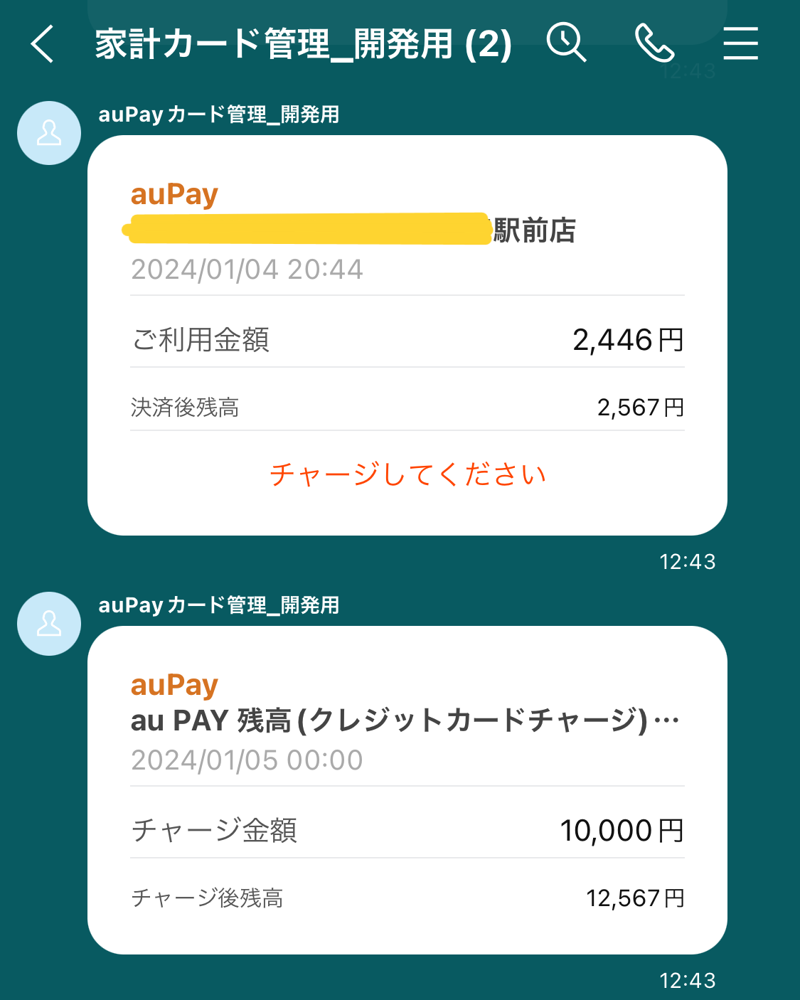 | 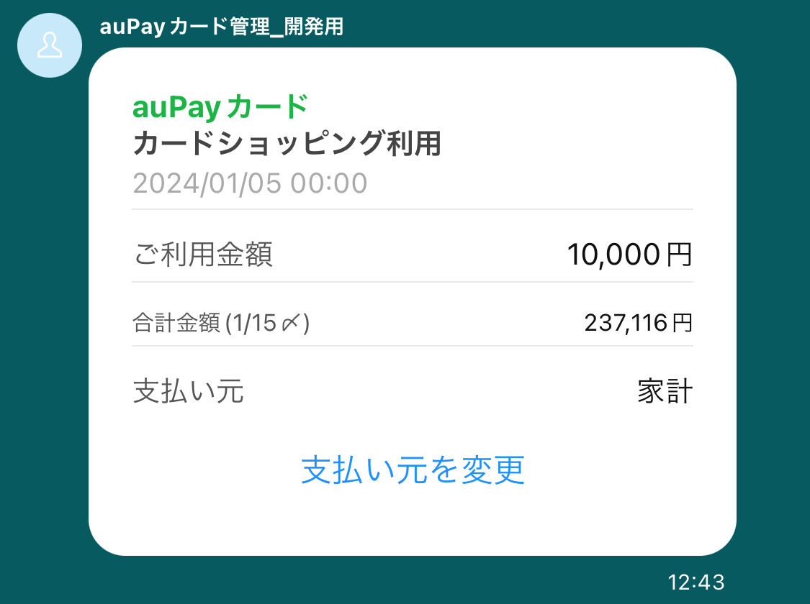 |

-   スプレッドシートへの記録
    -   au pay
        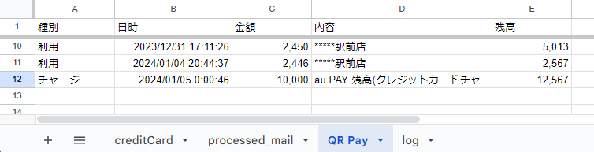
    -   au pay カード
        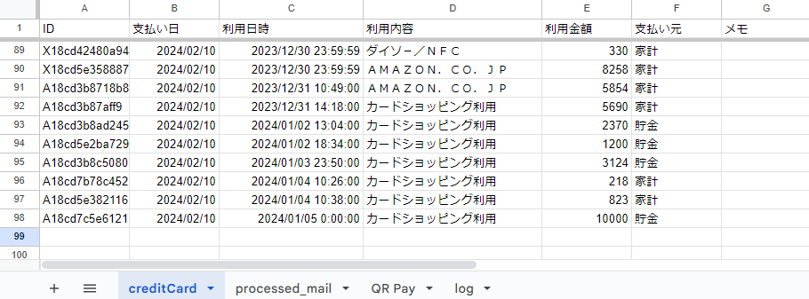

## au pay カード 利用後の支払い情報変更時

-   LINE 送信

| 支払い元変更ボタン押下                                    | 貯金へ変更                                                      | 特殊へ変更                                                       |
| --------------------------------------------------------- | --------------------------------------------------------------- | ---------------------------------------------------------------- |
| 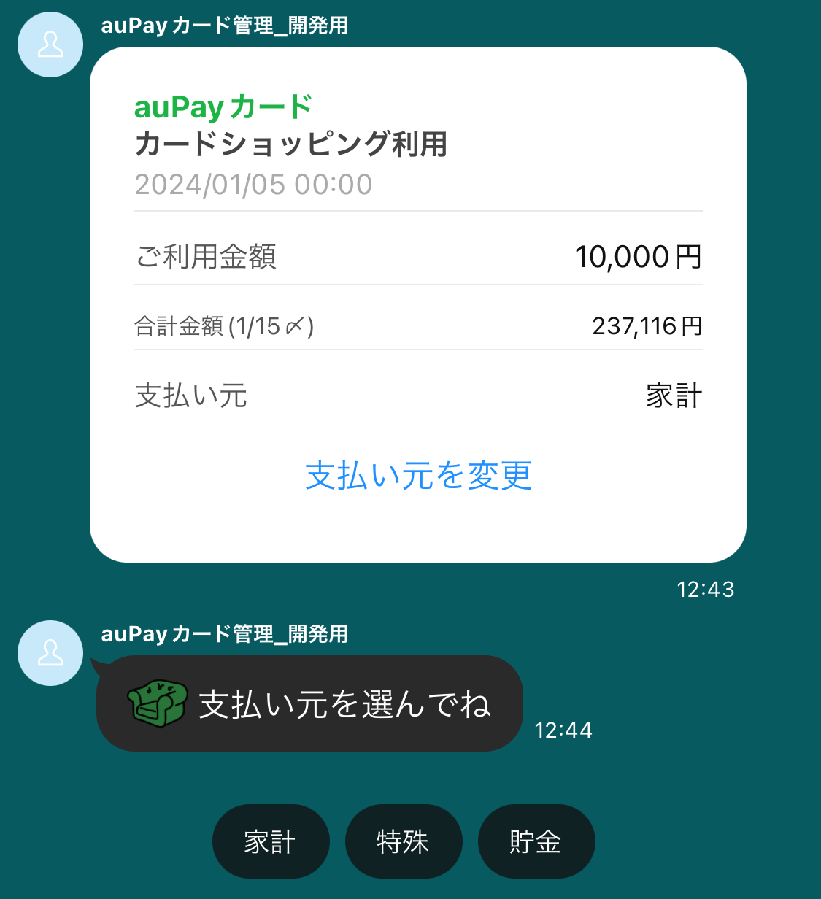 | 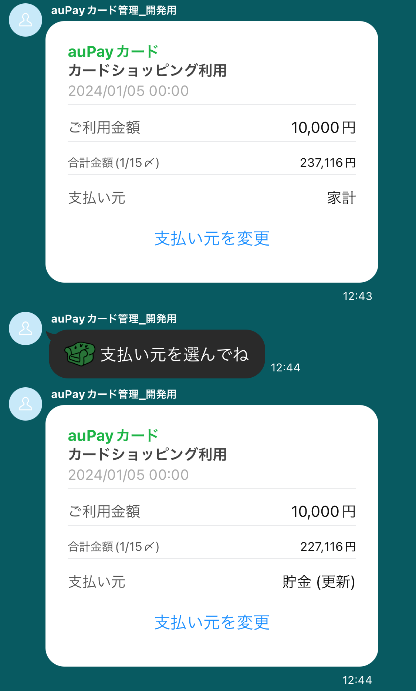 | 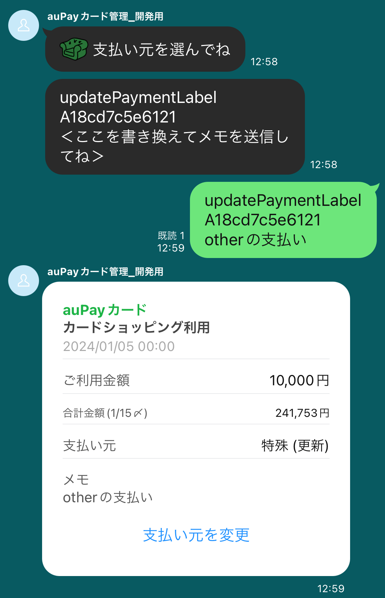 |

-   スプレッドシートへの記録
    -   au pay カード
        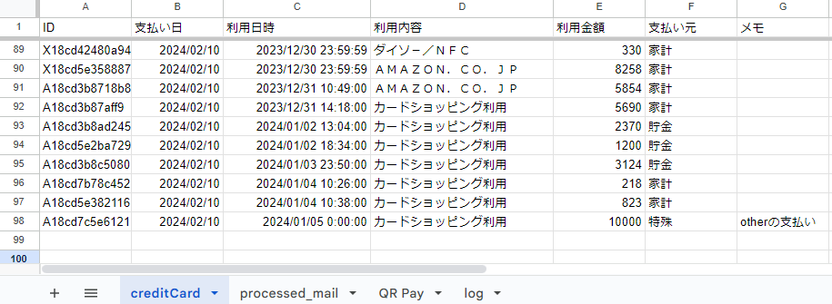

## 支払い金額確定時

支払い金額確定メール受信時以外にも、「合計」と送信することで支払い金額を確認できる。

| 支払い金額確定                                       |
| ---------------------------------------------------- |
| 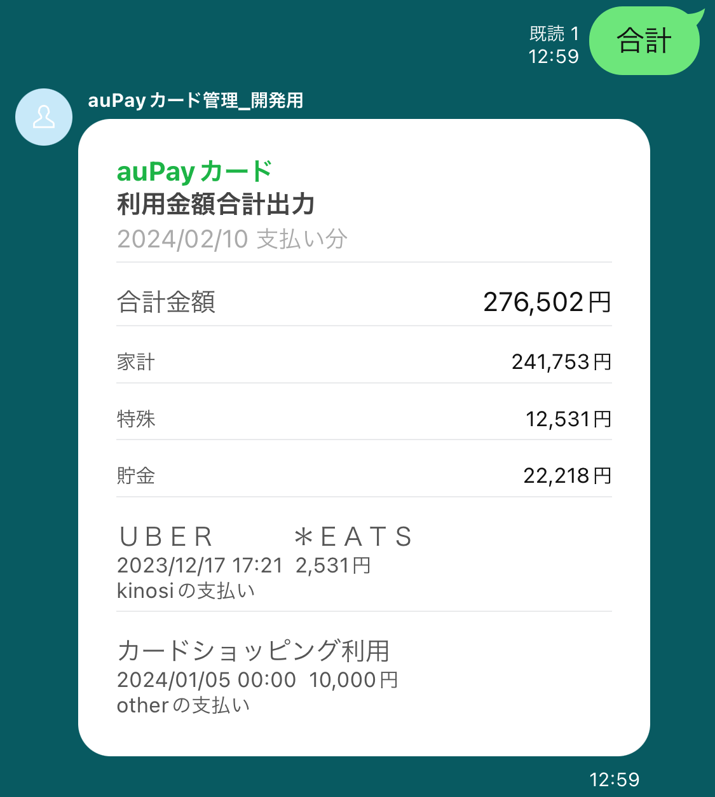 |

# 利用のためのセットアップ

上から順に実施すること。

## スプレッドシートの作成

1. [テンプレートのスプレッドシート](hoge)を開き、`ファイル > コピーを作成`から自分の Google フォルダにコピーする。

## LINE 通知設定(任意)

LINE 通知を送らない場合、設定は不要。

### スクリプトのデプロイ

1. コピーしたスプレッドシートを開き、`拡張機能 > Apps Script` を開く。
1. スクリプトをデプロイし、URL を控える。（[参考手順](https://qiita.com/cog1t0/items/cc7779345a01192d8f01#googleappscript%E3%81%AE%E3%82%B3%E3%83%BC%E3%83%89%E3%81%AB%E3%83%88%E3%83%BC%E3%82%AF%E3%83%B3%E3%82%92%E6%9B%B8%E3%81%8D%E8%BE%BC%E3%82%93%E3%81%A7%E3%83%87%E3%83%97%E3%83%AD%E3%82%A4%E3%82%92%E3%81%97%E3%81%BE%E3%81%99)）

### LINE 側の設定

1. ネットに転がっている記事を参考にチャンネルアクセストークンを取得する。
    - [LINE と GAS を連携し、自動返信するところまで設定します！【LINE BOT 制作】](https://webmarketerokb.com/2021/02/22/line%E3%81%A8gas%E3%82%92%E9%80%A3%E6%90%BA%E3%81%97%E3%80%81%E8%87%AA%E5%8B%95%E8%BF%94%E4%BF%A1%E3%81%99%E3%82%8B%E3%81%A8%E3%81%93%E3%82%8D%E3%81%BE%E3%81%A7%E8%A8%AD%E5%AE%9A%E3%81%97%E3%81%BE/)
    - [5 分でできる LINE Bot + AI 応答](https://qiita.com/cog1t0/items/cc7779345a01192d8f01)
1. Webhook 設定では前述の[スクリプトのデプロイ](#スクリプトのデプロイ)で取得した URL を設定する。

### GAS 側でスクリプトプロパティを設定

| プロパティ名        | 説明                                     | 設定値                 |
| ------------------- | ---------------------------------------- | ---------------------- |
| `LINE_NOTIFY`       | "TRUE"の場合のみ push 通知を送信する     | "TRUE" または それ以外 |
| `LINE_ACCESS_TOKEN` | push 通知用の チャンネルアクセストークン | -                      |
| `LINE_GROUP_ID`     | push 通知先のグループ ID                 | -                      |

-   `LINE_NOTIFY`については、スプレッドシート内カスタムメニュー の`LINE通知 > ON/OFF`でも設定値の変更が可能。
-   `LINE_ACCESS_TOKEN`が入力済みであれば、`LINE_GROUP_ID`は LINE で`ルームID`と送信することで取得できる。
    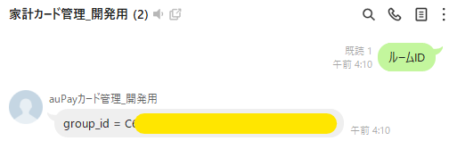

## 初回実行(任意)

定期実行で直近の受信メールは処理できる。
しかし、クレジットカード利用履歴などの過去の情報は重要な一方で、直近の受信ではなく処理できないので、初回でまとめて過去メールを処理する。

1. 「速報メール」のみを処理する
    - カスタムメニュー の`初回一括取得 > 速報メールのみを検索し処理する`
1. 「詳細メール」のみを処理する
    - カスタムメニュー の`初回一括取得 > 詳細メールのみを検索し処理する`

## 定期実行設定

直近の受信メールは処理するように定期実行を設定する。

1. コピーしたスプレッドシートを開き、`拡張機能 > Apps Script` を開く。
1. `トリガー > トリガーを追加`を開く。
1. 時間ベーストリガーで 1 分間隔で`main`を実行するように設定
   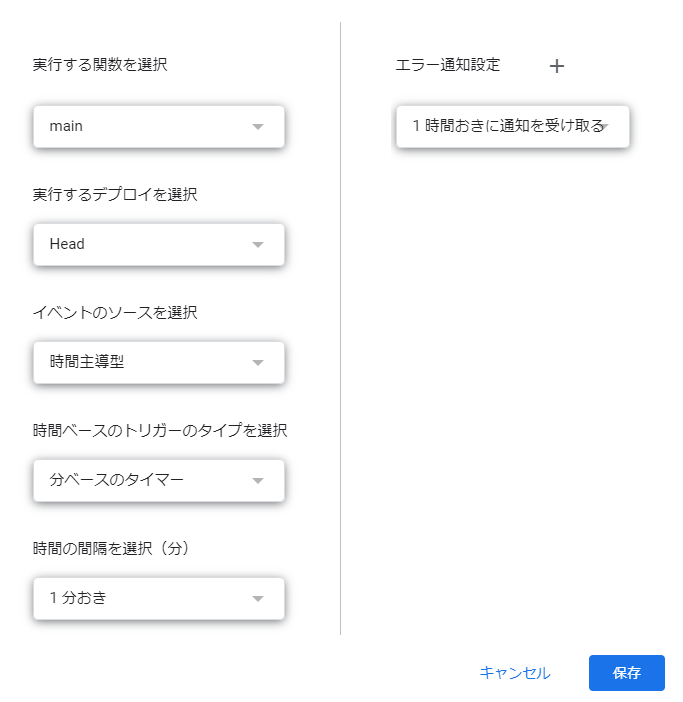

## アプリケーション設定(任意)

以下で設定される。  
適切に変更することで、自分の環境に合わせた設定が可能。

-   [sources/src/config.ts](./sources/src/config.ts)

# 開発

## コンセプト

[コンセプト](./docs/concept/concept.md)

## 全体像

typescript で開発を行い、esbuild でビルドした後、clasp でデプロイする。

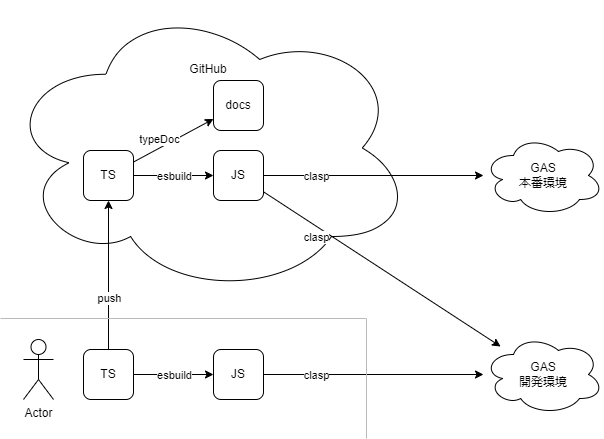

## 利用ツール

### eslint

`@types/google-apps-script`を導入して GAS の型定義を使用している。

### jest

単体テストを実施

### esbuild

[./sources/src](./sources/src)配下の typescript をビルドし、[./public/](./public/)配下に出力する設定を適用。

参考：[GAS + Typescript のいい感じのビルド環境を整える](https://zenn.dev/terass_dev/articles/a39ab8d0128eb1)

### clasp

[./public/](./public/)配下をデプロイする設定を適用。

対象メールを受信するアカウントで`clasp login`を実行し認証情報を取得すること。

## CI/CD

### 設定

参考：[GAS の Web アプリケーションを GithubActions & Clasp でデプロイする](https://qiita.com/shunexe/items/fdf0def390a160d044c3)

-   Actions secrets and variables
    -   ACCESS_TOKEN
    -   CLIENT_ID
    -   CLIENT_SECRET
    -   ID_TOKEN
    -   REFRESH_TOKEN
    -   MASTER_DEPLOYMENT_ID
    -   MASTER_SCRIPT_ID
    -   STAGING_DEPLOYMENT_ID
    -   STAGING_SCRIPT_ID

### 本番環境

-   master ブランチにコミットされるごとに自動デプロイされる

### 検証環境

-   ブランチに関わらずコミットされるごとに自動デプロイされる
    -   デプロイ後、typeDoc によるドキュメント生成が行われる
    -   class や interface のコメントを更新すると（生成されたドキュメントに差分があると）自動で push される

## ローカルから開発環境へ手動デプロイ

```sh
$ pwd
~/auPayManager

$ cat .env
STAGING_DEPLOYMENT_ID=******************
STAGING_SCRIPT_ID=******************

$ ./deployment/deploy_local.sh
~/auPayManager
└─ public/appsscript.json
└─ public/main.js
Pushed 2 files.
Created version 600.
- ************ @600.
```

## ディレクトリ構成

```sh
auPayManager
├── deployment          # デプロイ用スクリプトを格納
├── docs                # ドキュメントを格納
├── public              # ビルド後のスクリプトを格納
│   ├── appsscript.json
│   └── main.js         # ビルド後のエントリポイント
├── sources             # 開発用ソースコードを格納
│   └── src
│       ├── main.ts     # エントリポイント
│       ├── ...
├── build.ts            # esbuildでのビルドスクリプト
├── package-lock.json   # package.json のロックファイル
├── package.json        # パッケージ管理
└── tsconfig.json       # typescript の設定
```

# ドキュメント

## フローチャート

-   [時間トリガーで起動する場合](./docs/flowchart/flow_time_trigger.md)
-   [メッセージによる webhook トリガーで起動する場合](./docs/flowchart/flow_webhook_trigger.md)

## クラス図

[クラス図](./docs/assets/src_diagram.png)

## typeDoc

Documentation / [Exports](./docs/typedoc/README.md)
