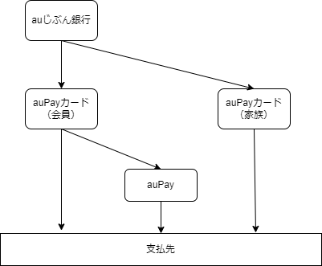
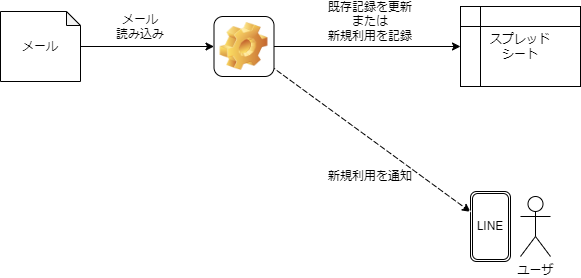
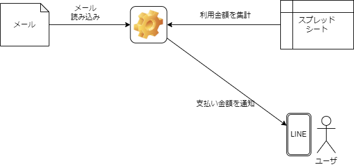
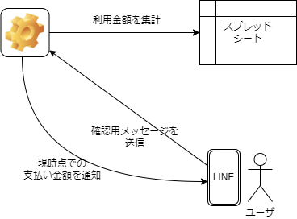
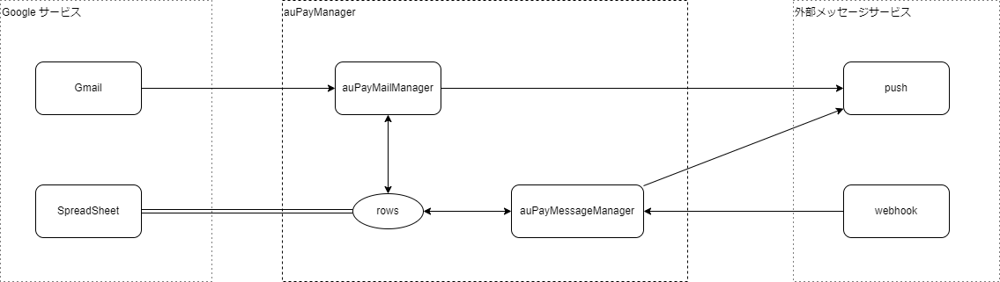

# やりたいこと

-   家計を管理する
    -   家族で支払いごとに利用金額を共有したい。
    -   家族で支払いごとに支払い元を設定したい。
    -   家族で締め日ごとに合計金額を共有したい。

# 家計で利用する金融サービス

-   基本的にはクレジットカードを利用し、一部 QR 決済を利用する。

    

-   QR 決済として、auPay を利用する。
    -   近所のスーパーが PayPay or auPay のみ対応しているため。
    -   PayPay は家計管理上使用しづらいため。
        -   日常使いしているため、私用の利用履歴が混ざってしまう
        -   将来的(2025/01)に、他社クレカでの直接決済が塞がれる
    -   auPay は家計管理上使用しやすいため。
        -   日常使いしていないため、私用の利用履歴が混ざってしまうことがない
        -   他社クレカでチャージできる
        -   ~~アカウント共有が一応可能~~ (規約上は NG)
-   クレジットカードとして、auPay カードを利用する。
    -   サービス改定を考慮し、同会社のサービスを利用する。
    -   家族カードを発行可能なため。
    -   利用通知がメールですべて送信されるため。
    -   還元率が常時 1%とそこそこ高いため。
-   引き落とし口座は何でもいいが、 au じぶん銀行を利用する。
    -   サービス改定を考慮し、同会社のサービスを利用する。
    -   振込回数が月 3 回まで無料のため。
    -   金利優遇がそこそこ高いため。

# 管理に利用する外部サービス

無償で利用できることを前提とする。

-   Google スプレッドシート
    -   利用履歴を管理するため。
-   LINE
    -   家族向けに利用金額を共有するため。
-   Google Apps Script
    -   受信したメールを読むため。
    -   スプレッドシートを操作するため。
    -   LINE に通知するため。

# 利用シーン

## メールトリガー

1.  クレジットカード利用速報メール

    

2.  クレジットカード利用詳細メール

    

3.  QR 決済利用メール

    

4.  QR 決済残高チャージメール

    

5.  クレジットカード請求金額確定メール

    

## メッセージトリガー

1. クレジットカード利用メッセージに対して、支払い元を設定する

    

1. 現時点でのクレジットカード利用金額を確認する

    

# 基本動作

## 動作概要

-   メールで配信されている auPay カードに関する情報をスプレッドシートに転記する。
-   支払い情報を管理するために、支払い元・支払いメモを転記する際に付与する。
-   支払い元・支払いメモは外部メッセージサービスから編集できるようにする。

## 実行タイミング

-   メールトリガー
-   メッセージトリガー

## データフロー

## 制約

-   スクリプトはでは原則として直にスプレッドシートのセルを操作しない。
    -   スクリプトはローカル 2 次元配列 を操作し、2 次元配列 をスプレッドシートに転写することでアップロードする方式を採る。
-   テストのために、できるだけ Google サービスに依存しない構成とする。

# 機能一覧

| 機能名                                               | トリガー種別 |
| :--------------------------------------------------- | :----------- |
| [利用速報メール処理](#利用速報メール処理)            | メール       |
| [利用詳細メール処理](#利用詳細メール処理)            | メール       |
| [請求金額メール処理](#請求金額メール処理)            | メール       |
| [auPAY 利用メール処理](#aupay利用メール処理)         | メール       |
| [auPAY チャージメール処理](#aupayチャージメール処理) | メール       |
| [支払い元変更](#支払い元変更)                        | メッセージ   |
| [支払いメモ追加](#支払いメモ追加)                    | メッセージ   |

# 機能詳細

## 利用速報メール処理

1. [【ご利用速報】au PAY カード](./メール.md#ご利用速報au-pay-カード) から以下情報を抽出する

    - <利用日時>
    - <利用内容>
    - <利用金額>

1. [クレジットカード利用レポートシート](./シート.md#クレジットカード利用レポートシート)に新規行として追記する

    - ID
        - `A`から始まる ID を採番する
    - 支払い日
        - <利用日時>から計算する
    - 利用日時
        - <利用日時>
    - 利用内容
        - <利用内容>
    - 利用金額
        - <利用金額>
    - 支払い元
        - `家計`を設定する
    - メモ
        - undefined を設定する

1. 以下情報を LINE に通知する

    - 上記情報の全て
    - 現時点での合計金額

1. [処理済みメールシート](./シート.md#処理済みメールシート)に新規行として追記する

## 利用詳細メール処理

1. [【ご利用詳細】au PAY カード](./メール.md#ご利用詳細au-pay-カード) から以下情報を抽出する（複数件記述される）

    - <利用日>
        - 時刻が記載されていないため、`23:59:59` とする
    - <利用金額>
    - <利用先>
    - <対象支払い月>

2. [クレジットカード利用レポートシート](./シート.md#クレジットカード利用レポートシート)に新規行として追記、または既存行を更新する

    1. 以下の全てを満たす行があった場合、その行の`利用内容`を<利用先>で更新する
        - 金額が一致
        - 未処理
            - `利用内容`が`カードショッピング利用`であること
        - 最古のレコード
            - 該当する行が複数ある場合があるため
    2. 上記を満たさない場合、新規行として追記する
        - ID
            - `X`から始まる ID を採番する
        - 支払い日
            - <利用日>から計算する
        - 利用日時
            - <利用日>
        - 利用内容
            - <利用先>
        - 利用金額
            - <利用金額>
        - 支払い元
            - `家計`を設定する
        - メモ
            - undefined を設定する

3. 新規行として追記した場合、以下情報を LINE に通知する

    - 上記情報の全て
    - 現時点での合計金額

4. [処理済みメールシート](./シート.md#処理済みメールシート)に新規行として追記する

## 請求金額メール処理

1. [【au PAY カード】ご請求金額確定のお知らせ](./メール.md#au-pay-カードご請求金額確定のお知らせ)から以下情報を抽出する

    - <支払い日>
        - 休日で前後することがあるため、日付を`10`にする。

1. [クレジットカード利用レポートシート](./シート.md#クレジットカード利用レポートシート)から以下情報を抽出する

    - 支払い日が<支払い日>の支払い合計金額
    - 支払い日が<支払い日>の支払いメモ

1. 以下情報を LINE に通知する
    - <支払い日>
    - 支払い日が<支払い日>の支払い合計金
    - 支払い日が<支払い日>の支払いメモ

## auPAY 利用メール処理

1. [【au PAY】ご利用のお知らせ](./メール.md#au-payご利用のお知らせ) から以下情報を抽出する

    - <利用日時>
    - <利用店舗>
    - <支払金額>
    - <決済後残高>

2. [QR Pay 利用・チャージレポートシート](./シート.md#qr-pay-利用・チャージレポートシート)に新規行として追記する

    - 種別
        - `利用`を設定する
    - 日時
        - <利用日時>
    - 金額
        - <支払金額>
    - 内容
        - <利用店舗>
    - 残高
        - <決済後残高>

3. 以下情報を LINE に通知する
    - 上記情報の全て
    - 決済後残高が一定以下の場合、その旨を通知する

## auPAY チャージメール処理

1. [【au PAY】チャージ完了のお知らせ](./メール.md#au-payチャージ完了のお知らせ) を受信する
1. 以下情報を抽出する
    - <チャージ日時>
    - <チャージ金額>
    - <チャージ方法>
    - <au PAY 残高>
1. スプレッドシートに新規行として追記する

    - 種別
        - `チャージ`
    - 日時
        - <チャージ日時>
    - 金額
        - <チャージ金額>
    - 内容
        - <チャージ方法>
    - 残高
        - <au PAY 残高>

1. 以下情報を LINE に通知する
    - 上記情報の全て

## 支払い元変更

1. LINE から「支払い元変更」メッセージを受信する
1. 支払い元を LINE 上で選択させる（クイックリプライ利用）
1. 選択された支払い元を[クレジットカード利用レポートシート](./シート.md#クレジットカード利用レポートシート)に反映する
1. 更新した内容を LINE に通知する

## 支払いメモ追加

1. LINE から「支払い元変更」メッセージを受信する
1. 支払い元を LINE 上で選択させる（クイックリプライ利用）
1. メモ可能な支払い元が選択された場合、メモを LINE 上で入力させるためのメッセージを送信する
1. メモを含むメッセージを受信し、[クレジットカード利用レポートシート](./シート.md#クレジットカード利用レポートシート)に反映する
1. 更新した内容を LINE に通知する
