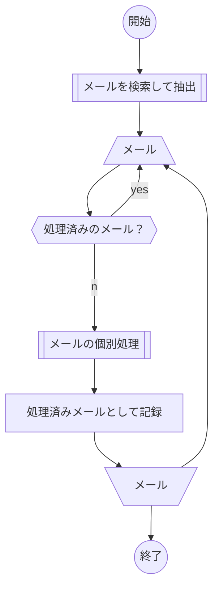
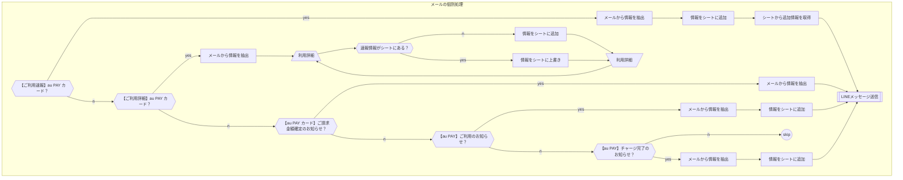

```mermaid
flowchart TD


START((開始)) -->
    searchMails[[メールを検索して抽出]] -->
    loopStartMails[/メール\]-->
        checkProcessedMail{{"処理済みのメール？"}}
        checkProcessedMail --yes--> loopStartMails
        checkProcessedMail --no--> processMail[[メールの個別処理]]
        processMail --> 処理済みメールとして記録
    --> loopEndMails[\メール/] --> loopStartMails
    loopEndMails[\メール/] -->
END((終了))

```

```mermaid
flowchart TD

subgraph メールの個別処理

    sendMessage[[LINEメッセージ送信]]


    mail1{{"【ご利用速報】au PAY カード？"}}
    mail1 --no--> mail2
    mail1 --yes--> mail1_func1[メールから情報を抽出] --> mail1_func2[情報をシートに追加] --> mail1_func3[シートから追加情報を取得] --> sendMessage


    mail2{{"【ご利用詳細】au PAY カード？"}}
    mail2 --no--> mail3
    mail2 --yes--> mail2_func1[メールから情報を抽出] -->
    loopStartInfo2[/利用詳細\]-->
        mail2_if1{{"速報情報がシートにある？"}}
        mail2_if1 --no-->  mail2_func2[情報をシートに追加] --> loopEndtInfo2
        mail2_if1 --yes-->  mail2_func3[情報をシートに上書き] --> loopEndtInfo2
    loopEndtInfo2[\利用詳細/] --> loopStartInfo2


    mail3{{"【au PAY カード】ご請求金額確定のお知らせ？"}}
    mail3 --no--> mail4
    mail3 --yes--> mail3_func1[メールから情報を抽出] --> sendMessage


    mail4{{"【au PAY】ご利用のお知らせ？"}}
    mail4 --no--> mail5
    mail4 --yes--> mail4_func1[メールから情報を抽出]  --> mail4_func2[情報をシートに追加] --> sendMessage


    mail5{{"【au PAY】チャージ完了のお知らせ？"}}
    mail5 --no--> skip((skip))
    mail5 --yes--> mail5_func1[メールから情報を抽出] --> mail5_func2[情報をシートに追加] --> sendMessage

end
```
