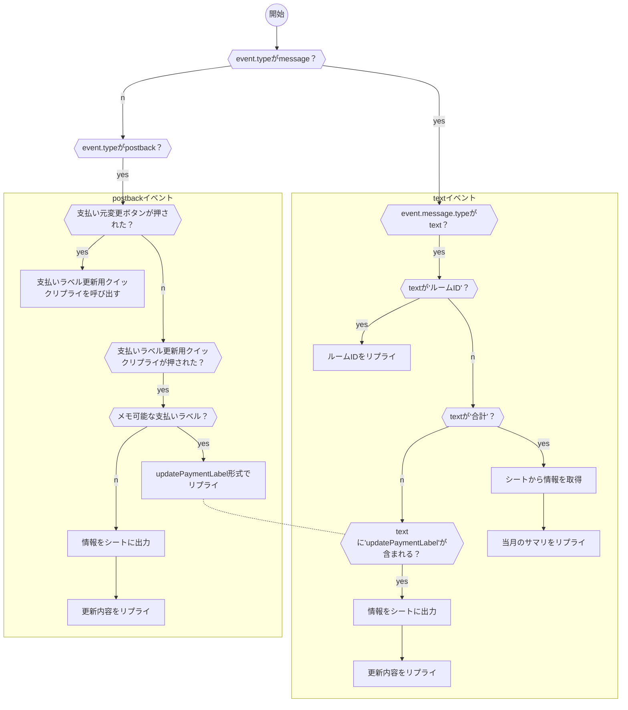

```mermaid
flowchart TD


START((開始)) -->
    event1{{"event.typeがmessage？"}}
    event1 --no--> event2{{"event.typeがpostback？"}}
    event1 --yes-->event1_if1
    event2 --yes--> event2_method1


subgraph textイベント
    event1_if1{{"event.message.typeがtext？"}}
        event1_if1 --yes-->
            event1_if2{{"textが'ルームID'？"}}
            event1_if2 --no-->
                event1_if3{{"textが'合計'？"}}
                event1_if3 --no-->
                    event1_if4{{"textに'updatePaymentLabel'が含まれる？"}}
                    event1_if4 --yes--> event1_if3_func1[情報をシートに出力] --> event1_if3_func2[更新内容をリプライ]
                event1_if3 --yes--> シートから情報を取得 --> 当月のサマリをリプライ
            event1_if2 --yes--> ルームIDをリプライ
end

subgraph postbackイベント
    event2_method1{{"支払い元変更ボタンが押された？"}}
    event2_method1 --no-->
        event2_method2{{"支払いラベル更新用クイックリプライが押された？"}}
        event2_method2 --yes-->
            event2_method2_if1{{"メモ可能な支払いラベル？"}}
            event2_method2_if1 --no--> event2_method2_if1_func1[情報をシートに出力] --> event2_method2_if1_func2[更新内容をリプライ]
            event2_method2_if1 --yes--> event2_method2_if1_func3[updatePaymentLabel形式でリプライ]
            event2_method2_if1_func3 -.- event1_if4
    event2_method1 --yes--> 支払いラベル更新用クイックリプライを呼び出す
end


```
